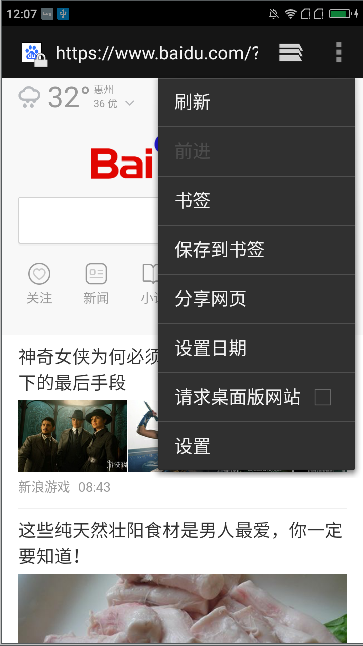
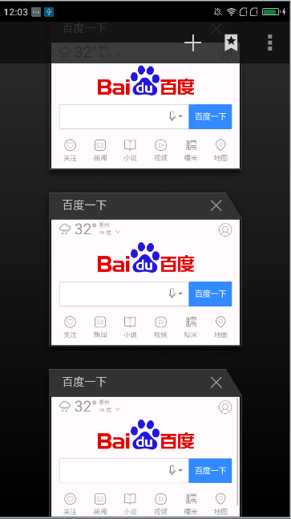
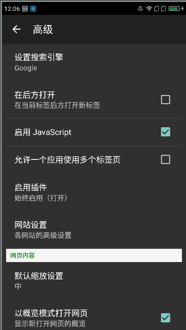
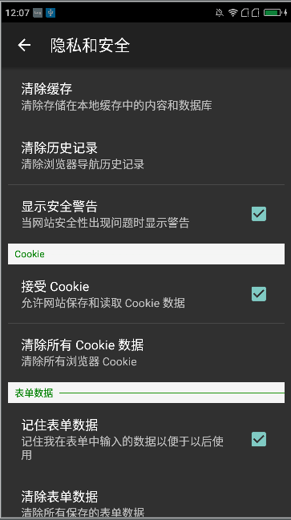

# Android 4.4 浏览器源代码
本浏览器项目的代码是直接从Android4.4代码中单独抽离出来的，项目中有比较多的地方使用了系统里面的一些
样式，所以我就使用了反射的机制去获取那些资源样式，这里的包名我没有修改如果你的系统修改变化不大的话，
那么系统中则会有与该浏览器相同的包名以及相同的`ContentProvider`的路径所以会安装不上的，这个时候我们
需要修改我们的包名以及`ContentProvider`的路径的。本次修改有两个问题：1、那个历史记录好像没有显示出来
不知道是哪里出问题了；2、修改浏览器显示字体的大小的`SeekBar`那个好像不能拖动。因为本浏览器整体来说都
比较简单所以市面上很多的壳浏览器基本上都是基于系统源代码改改样式，然后随着开发人员的增多，可能就会修改
整个的架构了。还有一些可能技术比较好的大公司则会选择修改开源的`chromium`浏览器。本项目旨在给大家要开发
自己的壳浏览器而做的准备，避免大家为了重复遭轮子又去重新弄了一套自己的东西，我们可以站在巨人的肩膀上进行
眺望远方，把精力用在产品的其他地方，把它的用户体验做的更好。请在大家尽量使用项目中的build.gradle的配置
因为其他的高版本的会导致一些不常见的编译问题，带来没有必要的麻烦。

## 效果图样子

下面我们来看看编译完成之后的效果图如何的

